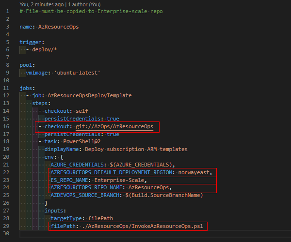

# AzResourceOps

Bring your own ARM templates to Enterprise-scale.

## Objectives

This IaC module is created to be used as an "extension" to Microsoft [Enterprise-scale](https://github.com/Azure/Enterprise-Scale) and [AzOps](https://github.com/Azure/AzOps).
The main focus of this project is to supplement [AzOps](https://github.com/Azure/AzOps) functionality and allow for deployment of all types of resources from your Enterprise-scale repo without having to modify any of the Enterprise-scale code maintained by Microsoft.
The philosophy is that you "bring your own ARM templates" to handle resources at resource group level.

### AzOps

AzResourceOps is not meant to replace AzOps functionality. You should still use AzOps to deploy resources within the scope of AzOps, like:

- Management Group hierarchy and Subscription organization
    - ResourceTypes:
        - Microsoft.Management/managementGroups
        - Microsoft.Management/managementGroups/subscriptions
        - Microsoft.Subscription/subscriptions
- Policy Definition and Policy Assignment for Governance
    - ResourceTypes:
        - Microsoft.Authorization/policyDefinitions
        - Microsoft.Authorization/policySetDefinitions
        - Microsoft.Authorization/policyAssignments
- Role Definition and Role Assignment
    - ResourceTypes:
        - Microsoft.Authorization/roleDefinitions
        - Microsoft.Authorization/roleAssignments

## Functionality

## Prerequisites

To start using AzResourceOps you need

- An existing [Enterprise-scale](https://github.com/Azure/Enterprise-Scale) repo setup.
- A service principal with Contributor permissions on subscriptions where you will deploy resources.

## Getting Started

- Clone this repository to your organization (currently only tested in Azure DevOps within the same organization as Enterprise-scale repo). The AzResourceOps repo must be possible to checkout from pipeline in your Enterprise-scale repo.
- Copy file `\.azure-pipelines\azresourceops-push.yml` to your Enterprise-scale repo.
- Change azresourceops-push.yml to reflect your environment.
    
- Create a new pipeline in Enterprise-scale repo from `azresourceops-push.yml`.
- Create a new secret pipeline variable called AZURE_CREDENTIALS containing your service principal, quotation marks should be escaped with `\`.
    ```json
    {
        "clientId": "xxxx-xxxx-xxxx-xxxx-xxxxx",
        "displayName": "AzOps",
        "name": "http://AzOps",
        "clientSecret": "xxxxxx-xxxx-xxxx-xxxx-xxxxxx",
        "tenantId": "xxxxxx-xxxx-xxxx-xxxx-xxxxxx",
        "subscriptionId": "xxxxxx-xxxx-xxxx-xxxx-xxxxxx"
    }
    ```

## How to use AzResourceOps

AzResourceOps requires a parameter file for each ARM template you wish to deploy. The parameter file has to have the same name as the ARM template with *.parameters.json appendend. I.ex. if you deploy a new Key Vault and the ARM template is called keyVault.json, your parameter file will have to be named keyVault.parameters.json.

The pipeline will trigger by default on push to all branches called deploy/*, where * is wildcard.

To deploy a new resource:

- Make sure to pull latest changes from main/master.
- Create a new branch in your Enterprise-scale repo called deploy/<something>.
- Copy your ARM template(s) and parameter file(s) to the resource group folder where you want to deploy the resources. If the resource group does not exist, you will need to deploy the resource group first.
- Resource group deployment file(s) will be placed in the folder of the subscription where you want to deploy the resource group(s).

## Limitations

- AzResourceOps is currently only tested in Azure DevOps, not GitHub or any other services.

## Contributing

This project welcomes contributions and suggestions.

## More Information

For more information:

* [AzOps](https://github.com/Azure/AzOps)
* [Enterprise-scale](https://github.com/Azure/Enterprise-Scale)
